# Agentic Enterprise OS - Architecture Graph

```mermaid
graph TB
    %% ============================================
    %% LAYER 5: GOVERNANCE & ORCHESTRATION
    %% ============================================
    subgraph L5["🏛️ LAYER 5: GOVERNANCE & ORCHESTRATION"]
        build_validator["build-validator<br/>Quality Gate & Validation"]
        ai_risk_governance["ai-risk-governance<br/>AI Safety & Risk"]
        eng_mgr_prompts["engineering-manager-agent-prompts-evals<br/>Agent Management"]
        eng_mgr_vertical["engineering-manager-vertical-ai-products<br/>Product Engineering Mgmt"]
        ai_skill_manager["ai-skill-manager<br/>Skill Registry & Routing"]
        tech_prog_mgr["technical-program-manager<br/>Program Coordination"]
        tech_prog_mgr_sec["technical-program-manager-security-cvd<br/>Security CVD"]
    end

    %% ============================================
    %% LAYER 4: AI & ML OPERATIONS
    %% ============================================
    subgraph L4["🤖 LAYER 4: AI & ML OPERATIONS"]
        ai_researcher["ai-researcher<br/>Research & Hypothesis"]
        ai_engineer["ai-engineer<br/>AI Application Dev"]
        ai_lead_ops["ai-lead-ops<br/>AI Operations Lead"]
        ai_redteam["ai-redteam<br/>AI Red Team"]
        ai_token_eng["ai-token-improvement-plan-engineer<br/>Token Optimization"]
        ai_context_eng["ai-context-engineer<br/>Context Management"]
        ai_memory_dev["ai-memory-developer<br/>Persistent Memory"]
        ai_skill_mgr_ops["ai-skill-manager<br/>Skill Lifecycle"]
        
        ml_research_safe["ml-research-engineer-safeguards<br/>Safe ML Research"]
        ml_systems_rl["ml-systems-engineer-rl-engineering<br/>RL Engineering"]
        ml_infra_safe["ml-infrastructure-engineer-safeguards<br/>Safe ML Infra"]
        
        prompt_eng["prompt-engineer<br/>Prompt Design"]
        prompt_eng_agent["prompt-engineer-agent-prompts-evals<br/>Agent Prompts & Evals"]
    end

    %% ============================================
    %% LAYER 3: DATA & ANALYTICS
    %% ============================================
    subgraph L3["📊 LAYER 3: DATA & ANALYTICS"]
        data_architect["data-architect<br/>Data Architecture"]
        data_warehouse["data-warehouse-engineer<br/>Warehouse & ETL"]
        analytics_eng["analytics-data-engineer<br/>Data Pipelines"]
        analytics_mgr["analytics-data-engineering-manager-product<br/>Analytics Product Mgmt"]
        data_scientist["data-scientist<br/>ML & Statistics"]
        bi_analyst["bi-analyst<br/>BI & Dashboards"]
        ontology_eng["ontology-engineer<br/>Knowledge Graphs"]
        data_ops_lead["data-system-ops-lead<br/>Data Operations"]
        data_manager["data-manager<br/>Data Program Mgmt"]
    end

    %% ============================================
    %% LAYER 2: INFRASTRUCTURE & SECURITY
    %% ============================================
    subgraph L2["🔒 LAYER 2: INFRASTRUCTURE & SECURITY"]
        infra_eng["infrastructure-engineer<br/>Cloud Infrastructure"]
        platform_eng["platform-engineer<br/>Platform Engineering"]
        cluster_deploy["cluster-deployment-engineer<br/>K8s Deployment"]
        devops["devops<br/>CI/CD & Automation"]
        devsecops["devsecops<br/>DevSecOps"]
        deployment_strat["deployment-strategist<br/>Deployment Strategy"]
        cybersecurity["cybersecurity<br/>Security Operations"]
        info_sec["information-security-engineer<br/>InfoSec Engineering"]
        incident_mgmt["incident-management-engineer<br/>Incident Response"]
        offensive_sec["offensive-security-analyst<br/>Red Team"]
        defensive_sec["defensive-security-analyst<br/>Blue Team"]
        compliance_eng["compliance-engineer<br/>Compliance Engineering"]
        
        %% D3FEND Framework
        subgraph D3FEND["🛡️ D3FEND Framework"]
            d3fend_harden["d3fend-harden<br/>Harden"]
            d3fend_detect["d3fend-detect<br/>Detect"]
            d3fend_evict["d3fend-evict<br/>Evict"]
            d3fend_isolate["d3fend-isolate<br/>Isolate"]
            d3fend_restore["d3fend-restore<br/>Restore"]
            d3fend_model["d3fend-model<br/>Model"]
            d3fend_deceive["d3fend-deceive<br/>Deceive"]
        end
    end

    %% ============================================
    %% LAYER 1: SOFTWARE ENGINEERING
    %% ============================================
    subgraph L1["💻 LAYER 1: SOFTWARE ENGINEERING"]
        senior_arch["senior-system-architecture<br/>System Architecture"]
        senior_fullstack["senior-fullstack-developer<br/>Senior Fullstack"]
        fullstack_eng["fullstack-software-engineer<br/>Fullstack Engineer"]
        senior_swe["senior-software-engineer<br/>Senior SWE"]
        senior_frontend["senior-frontend-software-engineer<br/>Senior Frontend"]
        ui_eng["ui-software-engineer<br/>UI Engineer"]
        ux_eng["ux-software-engineer<br/>UX Engineer"]
        web_app_dev["web-application-developer<br/>Web App Developer"]
        support_eng["support-engineer<br/>Support Engineering"]
    end

    %% ============================================
    %% LAYER 0: BUSINESS & OPERATIONS
    %% ============================================
    subgraph L0["💼 LAYER 0: BUSINESS & OPERATIONS"]
        biz_model["business-model-researcher<br/>Business Model Research"]
        biz_consult["business-consultant<br/>Business Consulting"]
        commercial_counsel["commercial-counsel<br/>Commercial Legal"]
        corporate_counsel["corporate-counsel<br/>Corporate Legal"]
        rev_accountant["senior-revenue-accountant<br/>Revenue Accounting"]
        deal_ops["deal-operations-administrator<br/>Deal Operations"]
        transaction_mgr["transaction-manager<br/>Transaction Management"]
        transaction_principal["transaction-principal<br/>Transaction Principal"]
        prod_mgmt_monet["product-management-monetization<br/>Product Monetization"]
        prod_mgmt_human["product-management-human-data-platform<br/>Human Data Platform"]
        product_designer["product-designer<br/>Product Design"]
        customer_ops["customer-ops-specialist<br/>Customer Operations"]
        prod_support["product-support-specialist<br/>Product Support"]
        community_exec["community-executive-escalations-program-manager<br/>Community & Escalations"]
        comm_lead["communication-lead<br/>Communication Lead"]
        dev_edu_lead["developer-education-lead<br/>Developer Education"]
        people_ops["people-operations-specialist<br/>People Operations"]
    end

    %% ============================================
    %% LAYER -1: PHYSICAL INFRASTRUCTURE
    %% ============================================
    subgraph Lm1["🏗️ LAYER -1: PHYSICAL INFRASTRUCTURE"]
        dc_design["data-center-design-execution-lead<br/>DC Design & Build"]
        dc_portfolio["data-center-portfolio-planning-execution-lead<br/>DC Portfolio Planning"]
        dc_compute["data-center-compute-supply-efficiency<br/>Compute Supply & Efficiency"]
        dir_capex["director-infrastructure-capex-accounting<br/>Capex Accounting"]
        sr_dc_capacity["senior-data-center-capacity-delivery-manager<br/>DC Capacity Delivery"]
        field_services["field-services-engineer<br/>Field Services"]
    end

    %% ============================================
    %% CROSS-CUTTING CONCERNS
    %% ============================================
    subgraph CrossCutting["⚡ CROSS-CUTTING CONCERNS"]
        build_validator
        ai_risk_governance
        compliance_eng
        ai_memory_dev
    end

    %% ============================================
    %% WORKFLOW CHAINS
    %% ============================================
    
    %% Data Pipeline Chain
    data_architect -->|Design| data_warehouse
    data_warehouse -->|Build ETL| analytics_eng
    analytics_eng -->|Pipelines| data_scientist
    data_scientist -->|Models| bi_analyst
    bi_analyst -->|Dashboards| data_ops_lead
    data_ops_lead -->|Monitor| data_manager
    
    %% Security Chain
    offensive_sec -->|Red Team| defensive_sec
    defensive_sec -->|Blue Team| d3fend_harden
    d3fend_harden -->|Harden| d3fend_detect
    d3fend_detect -->|Detect| d3fend_evict
    d3fend_evict -->|Evict| d3fend_isolate
    d3fend_isolate -->|Isolate| d3fend_restore
    d3fend_restore -->|Restore| d3fend_model
    d3fend_model -->|Model| d3fend_deceive
    d3fend_deceive -->|Deceive| compliance_eng
    compliance_eng -->|Audit| incident_mgmt
    
    %% Revenue Chain
    commercial_counsel -->|Contract| deal_ops
    deal_ops -->|Execution| rev_accountant
    rev_accountant -->|Recognition| prod_mgmt_monet
    prod_mgmt_monet -->|Pricing| transaction_mgr
    transaction_mgr -->|Process| transaction_principal
    
    %% AI Development Chain
    ai_researcher -->|Research| ml_research_safe
    ml_research_safe -->|Safe Experiments| ml_systems_rl
    ml_systems_rl -->|RL Training| ml_infra_safe
    ml_infra_safe -->|Deploy| ai_engineer
    ai_engineer -->|Application| ai_lead_ops
    
    %% Software Dev Chain
    senior_arch -->|Architecture| senior_fullstack
    senior_fullstack -->|Implementation| senior_frontend
    senior_frontend -->|UI Components| ui_eng
    ui_eng -->|UX Patterns| ux_eng
    ux_eng -->|Support| support_eng
    
    %% Infrastructure Chain
    infra_eng -->|Cloud| platform_eng
    platform_eng -->|Platform| cluster_deploy
    cluster_deploy -->|K8s| devops
    devops -->|CI/CD| devsecops
    devsecops -->|Security| deployment_strat
    
    %% Physical Infra Chain
    dc_portfolio -->|Planning| dc_design
    dc_design -->|Build| dc_compute
    dc_compute -->|Supply| dir_capex
    dir_capex -->|Accounting| sr_dc_capacity
    sr_dc_capacity -->|Delivery| field_services
    
    %% Business Chain
    biz_model -->|Research| biz_consult
    biz_consult -->|Strategy| prod_mgmt_human
    prod_mgmt_human -->|Platform| product_designer
    product_designer -->|Design| customer_ops
    customer_ops -->|Support| prod_support
    prod_support -->|Community| community_exec
    community_exec -->|Communication| comm_lead
    comm_lead -->|Education| dev_edu_lead
    dev_edu_lead -->|People| people_ops
    
    %% Governance Connections
    build_validator -.->|Validate| data_architect
    build_validator -.->|Validate| infra_eng
    build_validator -.->|Validate| senior_arch
    build_validator -.->|Validate| ai_engineer
    build_validator -.->|Validate| rev_accountant
    
    ai_risk_governance -.->|Govern| ai_researcher
    ai_risk_governance -.->|Govern| ml_research_safe
    ai_risk_governance -.->|Govern| ml_systems_rl
    ai_risk_governance -.->|Govern| ai_redteam
    
    compliance_eng -.->|Compliance| rev_accountant
    compliance_eng -.->|Compliance| deal_ops
    compliance_eng -.->|Compliance| cybersecurity
    
    ai_memory_dev -.->|Context| ai_context_eng
    ai_memory_dev -.->|Context| prompt_eng
    ai_memory_dev -.->|Context| ai_skill_mgr_ops
    
    %% Cross-Layer Dependencies
    infra_eng -->|Hosts| data_architect
    platform_eng -->|Hosts| ai_engineer
    devops -->|Deploys| senior_fullstack
    cybersecurity -->|Protects| data_scientist
    compliance_eng -->|Regulates| rev_accountant
    
    %% Orchestration
    eng_mgr_prompts -.->|Manage| ai_engineer
    eng_mgr_prompts -.->|Manage| ml_systems_rl
    eng_mgr_vertical -.->|Manage| product_designer
    eng_mgr_vertical -.->|Manage| senior_fullstack
    ai_skill_manager -.->|Route| all_skills
    tech_prog_mgr -.->|Coordinate| data_manager
    tech_prog_mgr -.->|Coordinate| infra_eng
    tech_prog_mgr_sec -.->|Coordinate| cybersecurity
    tech_prog_mgr_sec -.->|Coordinate| compliance_eng
    
    %% Styling
    classDef layer5 fill:#1a1a2e,stroke:#e94560,stroke-width:3px,color:#fff
    classDef layer4 fill:#16213e,stroke:#0f3460,stroke-width:3px,color:#fff
    classDef layer3 fill:#1a1a2e,stroke:#533483,stroke-width:3px,color:#fff
    classDef layer2 fill:#0f3460,stroke:#e94560,stroke-width:3px,color:#fff
    classDef layer1 fill:#16213e,stroke:#533483,stroke-width:3px,color:#fff
    classDef layer0 fill:#1a1a2e,stroke:#0f3460,stroke-width:3px,color:#fff
    classDef layerm1 fill:#0f3460,stroke:#e94560,stroke-width:3px,color:#fff
    classDef d3fend fill:#533483,stroke:#e94560,stroke-width:2px,color:#fff
    classDef cross fill:#e94560,stroke:#fff,stroke-width:3px,color:#fff
    
    class build_validator,ai_risk_governance,eng_mgr_prompts,eng_mgr_vertical,ai_skill_manager,tech_prog_mgr,tech_prog_mgr_sec layer5
    class ai_researcher,ai_engineer,ai_lead_ops,ai_redteam,ai_token_eng,ai_context_eng,ai_memory_dev,ai_skill_mgr_ops,ml_research_safe,ml_systems_rl,ml_infra_safe,prompt_eng,prompt_eng_agent layer4
    class data_architect,data_warehouse,analytics_eng,analytics_mgr,data_scientist,bi_analyst,ontology_eng,data_ops_lead,data_manager layer3
    class infra_eng,platform_eng,cluster_deploy,devops,devsecops,deployment_strat,cybersecurity,info_sec,incident_mgmt,offensive_sec,defensive_sec,compliance_eng layer2
    class d3fend_harden,d3fend_detect,d3fend_evict,d3fend_isolate,d3fend_restore,d3fend_model,d3fend_deceive d3fend
    class senior_arch,senior_fullstack,fullstack_eng,senior_swe,senior_frontend,ui_eng,ux_eng,web_app_dev,support_eng layer1
    class biz_model,biz_consult,commercial_counsel,corporate_counsel,rev_accountant,deal_ops,transaction_mgr,transaction_principal,prod_mgmt_monet,prod_mgmt_human,product_designer,customer_ops,prod_support,community_exec,comm_lead,dev_edu_lead,people_ops layer0
    class dc_design,dc_portfolio,dc_compute,dir_capex,sr_dc_capacity,field_services layerm1
    class build_validator,ai_risk_governance,compliance_eng,ai_memory_dev cross
```



---

## Workflow Chains Detail

### Data Pipeline Chain
```
data-architect → data-warehouse-engineer → analytics-data-engineer → data-scientist → bi-analyst → data-system-ops-lead → data-manager
```

### Security Operations Chain
```
offensive-security-analyst → defensive-security-analyst → D3FEND (7 skills) → compliance-engineer → incident-management-engineer
```

### Revenue Operations Chain
```
commercial-counsel → deal-operations-administrator → senior-revenue-accountant → product-management-monetization → transaction-manager → transaction-principal
```

### AI Development Chain
```
ai-researcher → ml-research-engineer-safeguards → ml-systems-engineer-rl-engineering → ml-infrastructure-engineer-safeguards → ai-engineer → ai-lead-ops
```

### Software Development Chain
```
senior-system-architecture → senior-fullstack-developer → senior-frontend-software-engineer → ui-software-engineer → ux-software-engineer → support-engineer
```

### Infrastructure Chain
```
infrastructure-engineer → platform-engineer → cluster-deployment-engineer → devops → devsecops → deployment-strategist
```

### Physical Infrastructure Chain
```
data-center-portfolio-planning → data-center-design-execution → data-center-compute-supply → director-infrastructure-capex → senior-data-center-capacity → field-services-engineer
```

### Business Operations Chain
```
business-model-researcher → business-consultant → product-management-human-data → product-designer → customer-ops-specialist → product-support-specialist → community-executive → communication-lead → developer-education-lead → people-operations-specialist
```
