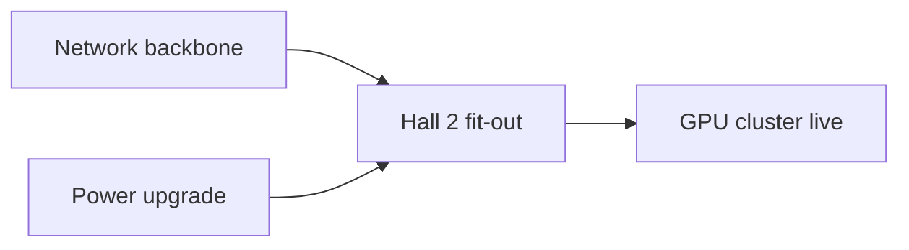

# Execution Governance

## Stage gates (portfolio)

| Gate | Entry criteria | Exit artifacts |
|---|---|---|
| **0 Concept** | Demand gap identified | Problem statement, rough $ |
| **1 Approved** | Business case, site option | Charter, budget slot |
| **2 Execute** | Design baseline, contracts | Schedule, RAID |
| **3 Ready for service** | Commissioning complete | Acceptance, runbooks |
| **4 Operate** | Handoff to ops | SLAs, capacity in roadmap |

Align site gates with `data-center-design-execution-lead` phases—do not duplicate two conflicting gate models.

## Portfolio RAID

Track **cross-cutting** items only; site RAID stays with site DRI.

| Type | Portfolio examples |
|---|---|
| **Risk** | GPU lead time slips all regions; utility power cap |
| **Issue** | Colo vendor dispute affecting two sites |
| **Action** | Standardize SKU by Q3 |
| **Decision** | Choose primary EU expansion site |

## Dependency map

Rules:

- One **critical path** per portfolio release
- Flag circular dependencies before steering

## Milestone tracking

| Level | Granularity |
|---|---|
| Portfolio | Initiative % complete, $ spent, next gate |
| Site | MEP, install, commissioning dates |
| Program | Use `technical-program-manager` patterns if mixed software+DC |

## Escalation

| Trigger | Escalate to |
|---|---|
| >4 weeks slip on critical path | Steering |
| Capex overrun >X% | Finance + steering |
| Safety or compliance stop-work | Exec + compliance |
