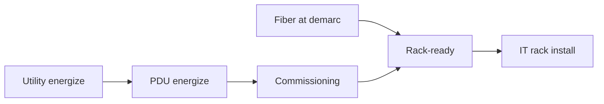

# Workstream Coordination

## Workstreams

| Workstream | Lead role | Key deliverables |
|---|---|---|
| **Design** | Design execution lead | Drawings, specs, submittals |
| **Power** | Electrical / utility | Feed, PDUs, grounding, UPS |
| **Cooling** | Mechanical | CRAC/LCU, piping, controls |
| **Construction** | GC or colo PM | Fit-out, fire, life safety |
| **Network** | Network infra | Demarc, cross-connects, backbone |
| **Security** | Physical security | Access, CCTV, mantrap |
| **DCIM / BMS** | Facilities automation | Points, alarms, dashboards |
| **IT install** | Infra / cluster team | Racks, cabling, clusters |

Delivery manager **integrates** schedules; workstream leads **own** technical decisions.

## Weekly integration meeting

Agenda (60 min max):

1. Critical path and float consumed
2. Blockers requiring cross-workstream decision
3. Change orders and schedule impact
4. Safety and site access
5. Next week lookahead

## Dependency examples

## Colo vs owned

| Mode | Delivery manager focus |
|---|---|
| **Colo** | SLA milestones, landlord delays, meet-me |
| **Owned** | Permits, GC, utility coordination |

## Handoff to design lead

Design changes after IFC:

- Impact assessment on date and cost
- Single ECO log; no verbal scope creep
