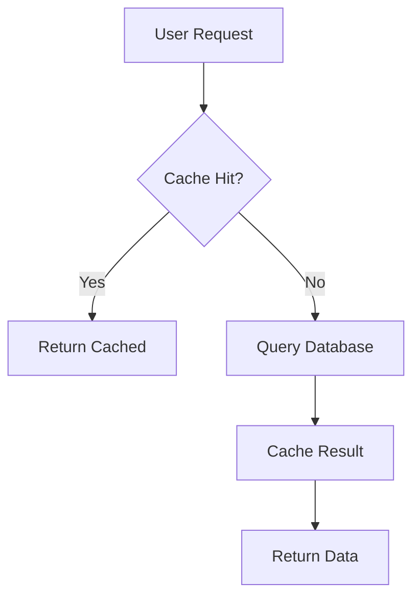

# Tools & Frameworks

## Markup Languages

| Language | Best For | Example |
|---|---|---|
| Markdown | Developer docs, READMEs, wikis | GitHub, MkDocs, Docusaurus |
| reStructuredText | Python ecosystem, Sphinx | Python docs, Read the Docs |
| AsciiDoc | Enterprise, complex structures | Antora, Asciidoctor |
| DITA | Structured content, reuse | Oxygen, IBM docs |
| XML | Legacy, highly structured | MadCap Flare, FrameMaker |

## Docs-as-Code Stack

### Static Site Generators
| Tool | Language | Best For |
|---|---|---|
| Docusaurus | React/Node | Open source projects, versioning |
| MkDocs | Python | Simple, fast setup |
| GitBook | SaaS | Collaboration, GitHub sync |
| Hugo | Go | Performance, large sites |
| Gatsby | React | Custom designs, MDX |
| Jekyll | Ruby | GitHub Pages, blogs |
| Antora | Node | Modular docs, multiple repos |

### Documentation Platforms
| Platform | Features | Cost |
|---|---|---|
| ReadMe | API docs, developer hubs | Paid |
| Stoplight | API design + docs | Freemium |
| Postman | API testing + documentation | Freemium |
| Swagger UI | OpenAPI rendering | Open source |
| Redoc | OpenAPI rendering | Open source |

## Linting & Quality

| Tool | Checks | Integration |
|---|---|---|
| Vale | Style, readability, terminology | CLI, VS Code, CI |
| markdownlint | Markdown formatting | CLI, VS Code |
| proselint | English prose style | CLI |
| write-good | Passive voice, weasel words | CLI, editor |
| alex | Inclusive language | CLI, editor |

**Vale configuration example (.vale.ini):**
```ini
StylesPath = .github/styles
MinAlertLevel = suggestion

Packages = Google, write-good

[*.md]
BasedOnStyles = Vale, Google, write-good
Google.Headings = NO
```

## Diagram Tools

| Tool | Output | Best For |
|---|---|---|
| Mermaid | Markdown-embedded diagrams | GitHub, docs sites |
| PlantUML | UML diagrams | Architecture docs |
| Draw.io | General diagrams | Visual design |
| Excalidraw | Hand-drawn style | Sketches, wireframes |
| Graphviz | Graph structures | Dependency maps |

**Mermaid example:**


## API Documentation

### OpenAPI / Swagger
```yaml
openapi: 3.0.0
info:
  title: Example API
  version: 1.0.0
paths:
  /users/{id}:
    get:
      summary: Get user by ID
      parameters:
        - name: id
          in: path
          required: true
          schema:
            type: string
      responses:
        '200':
          description: User found
          content:
            application/json:
              schema:
                $ref: '#/components/schemas/User'
```

### Code Annotation Tools
| Language | Tool | Format |
|---|---|---|
| Python | Sphinx, mkdocstrings | Docstrings |
| JavaScript | JSDoc, TypeDoc | JSDoc comments |
| Java | Javadoc | Javadoc comments |
| Go | godoc | Godoc comments |
| Rust | rustdoc | Markdown comments |

## Research Tools

| Tool | Purpose | Cost |
|---|---|---|
| Google Scholar | Academic search | Free |
| Semantic Scholar | AI-powered paper search | Free |
| Zotero | Reference management | Free |
| Notion / Obsidian | Research notes, linking | Freemium |
| Elicit | AI research assistant | Freemium |
| Connected Papers | Citation graph exploration | Freemium |

## Version Control for Docs

### Git Workflow for Documentation
```
main (published)
  └── develop (staging)
        └── feature/docs-update-123
```

**Branch naming:**
- `docs/update-readme`
- `docs/api-version-2`
- `docs/fix-typo-getting-started`

**Commit conventions:**
```
docs: update API reference for v2
docs: fix broken links in tutorial
docs: add troubleshooting section
```

## Collaboration Workflows

### Review Process
1. Writer creates PR with documentation changes
2. Automated checks (Vale, link checker, build)
3. SME review for accuracy (request or required)
4. Editor review for style and clarity
5. Merge and deploy (continuous or scheduled)

### Feedback Collection
- In-page feedback widget ("Was this helpful?")
- GitHub issues with "documentation" label
- Slack/Discord channel for doc questions
- Quarterly user surveys

## Accessibility Tools

| Tool | Check | Integration |
|---|---|---|
| axe DevTools | WCAG compliance | Browser extension |
| WAVE | Accessibility issues | Web, browser |
| Lighthouse | Multiple audits | Chrome, CI |
| pa11y | Automated testing | CLI, CI |

## Content Management

| Tool | Type | Best For |
|---|---|---|
| Sanity | Headless CMS | Structured content |
| Contentful | Headless CMS | Enterprise scale |
| Strapi | Open source CMS | Self-hosted |
| Notion | Wiki + database | Team knowledge base |
| Confluence | Enterprise wiki | Atlassian ecosystem |
| GitBook | Docs platform | GitHub-centric |
